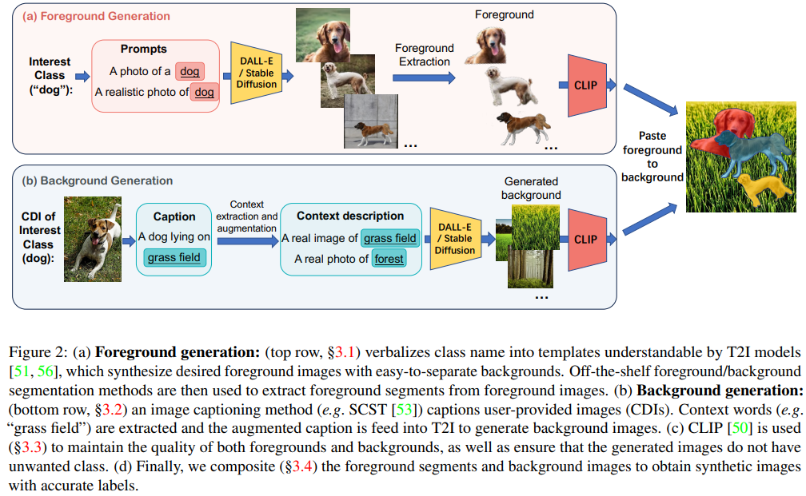
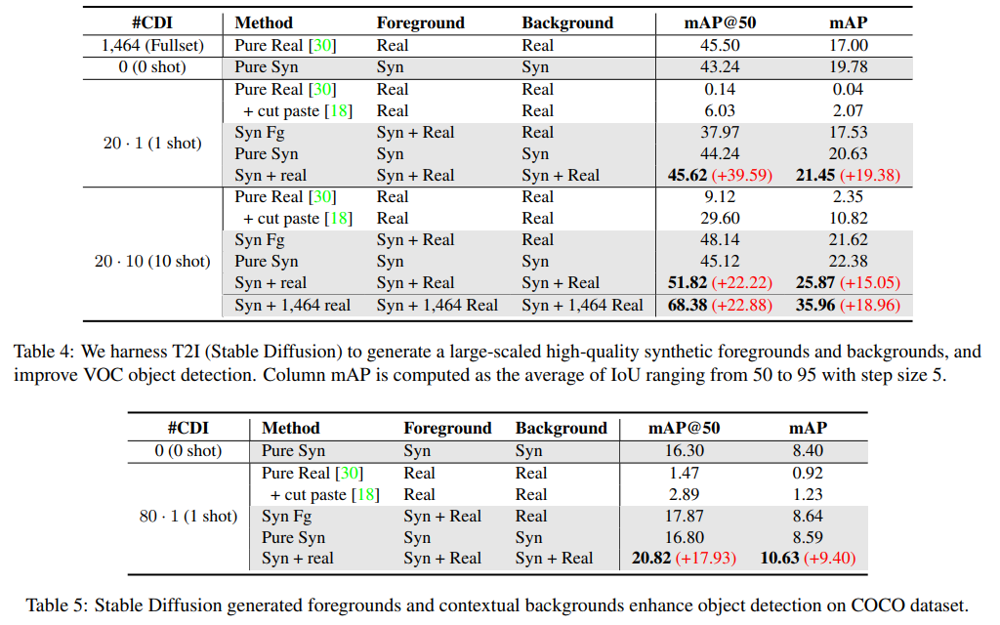

# Text2Image-for-Detection

Official Implementation for ["DALL-E for Detection: Language-driven Compositional Image Synthesis for Object Detection"](https://arxiv.org/pdf/2309.05956.pdf) 

Extention version: ["Beyond Generation: Harnessing Text to Image Models for Object Detection and Segmentation"](https://arxiv.org/pdf/2309.05956.pdf)

<div align="center">
    <span><a href="https://gyhandy.github.io/"><strong>Yunhao Ge*</strong></a>,&nbsp;&nbsp;</span>
    <span><a href="https://cnut1648.github.io/"><strong>Jiashu Xu*</strong></a>,&nbsp;&nbsp;</span>
    <span><a href="https://scholar.google.com/citations?user=IhqFMeUAAAAJ&hl=en"><strong>Brian Nlong Zhao</strong></a>,&nbsp;&nbsp;</span>
    <span><a href="https://neelj.com/"><strong>Neel Joshi</strong></a>,&nbsp;&nbsp;</span>
    <span><a href="http://ilab.usc.edu/itti/"><strong>Laurent Itti</strong></a>,&nbsp;&nbsp;</span>
    <span><a href="https://vibhav-vineet.github.io/"><strong>Vibhav Vineet</strong></a></span>
</div>

Contact: [yunhaoge@usc.edu](mailto:yunhaoge@usc.edu);  [jxu1@g.harvard.edu](mailto:jxu1@g.harvard.edu)

## Install

This project is developed using Python 3.10 and PyTorch 1.10.1 under CUDA 11.3. We recommend you to use the same version of Python and PyTorch. 

```bash
pip install -r requirements.txt
```

## Our method

<p align="center">
  
</p>

We propose a noval approach for generating diverse and large-scale pseudo-labeled training datasets, tailored specifically to enhance downstream
object detection and segmentation models. 
We leverage text-to-image models (e.g. your favourite diffusion model) to independently generate foregrounds and backgrounds. 
Then we composite foregrounds onto the backgrounds, a process where we obtain the bounding boxes or segmentation masks of the foregrounds, to be used in the downstream models.

Specifically, 
- Foregrounds are generated using text-to-image models with fixed templates (such as "A photo of <object>", Table 2 of the paper). Note this is purely zero-shot, i.e. no training data whatsoever is required.
- Backgrounds are slightly more complicated. 
     - For zero-shot, we have another set of fixed templates (such as "A real photo of forest", Table 3 of the paper). 
   - For few-shot where we have a limited set of training images, we first image caption each images, 
        then extract the background contextual words from the caption. Those contextual words are words such as "grass field," indicating the location and context of the training images.
       Lastly we augment the original caption by inputting the contextual words into the templates. 
       This step is necessary as otherwise the caption would possibly contain the foreground objects (eg a dog) as well, 
and using this original caption into the text-to-image models will likely generate a dog that we do not have a segmentation or bounding box label, and thus confusing the model.
- Both foregrounds and backgrounds are feed into CLIP to control the quality of the generated images.

## Usage

### Data
In this project we use Pascal VOC in a low-resource regime.

You should download original dataset, e.g. [Pascal VOC](http://host.robots.ox.ac.uk/pascal/VOC/voc2012/). 
Note that for Pascal we use train & Val set from the [nsrom repo](https://github.com/NUST-Machine-Intelligence-Laboratory/nsrom).
The data structure will be
```
data
├── COCO2017 
└── voc2012
    ├── labels.txt
    ├── train_aug.txt
    ├── ...
    └── VOC2012
        ├── Annotations
        ├── ImageSets
        ...
```
We have k-shot selections on `data/voc2012`:
[1 shot](data/voc2012/train_cls-1shot.txt) and [10 shot](data/voc2012/train_cls-10shot.txt).

### Diffusion Generation
The code to generate foregrounds and backgrounds are in `t2i_generate/` folder.
First you need to generate captions for [foreground](t2i_generate/foreground_captions.py) and [background](t2i_generate/background_captions.py).
Then you can use stable diffusion 2 to generate images via `python stable_diffusion2.py`.

### Cut Paste
The code to paste foregrounds onto backgrounds are in `cutpaste/` folder.
We use [hydra+torch lightning](https://github.com/ashleve/lightning-hydra-template) to run different variants.
Example config files are in `configs/` folder, and we include a test dataset in `data/test_data/` folder.
For example, you can use `python paste.py exp=<exp>` to launch the script, where `<exp>` is

- [`demo_cutpaste`](cutpaste/config/exp/demo_cutpaste.yaml): paste real foregrounds onto real backgrounds. This is **Pure Real + cut paste** in [Results](#results).
- [`demo_synFg`](cutpaste/config/exp/demo_synFg.yaml): paste synthetic foregrounds onto real backgrounds. This is **Syn Fg** in [Results](#results).
- [`demo_syn`](cutpaste/config/exp/demo_syn.yaml): paste synthetic foregrounds onto synthetic backgrounds. This is **Pure Syn** in [Results](#results).
- [`demo_syn+real`](cutpaste/config/exp/demo_syn+real.yaml): paste synthetic and real foregrounds onto synthetic and real backgrounds. This is **Syn + real** in [Results](#results).
  We recommend you to always use this setting as this offers the benefit of both synthetic and real data.

You can also use `viz/` to visualize the generated datasets. Simple do
```shell
python viz/viz.py <cut paste dataset dir>
```
This will generate 30 randomly sampled annotated images in `viz/` folder.

Readers are welcome to check the config files for more parameters to control the process. Some notable mentions:
 - by default the foreground is pasted with Space Maximize Paste algorithm described in [EM-paste](https://arxiv.org/pdf/2212.07629.pdf): i.e. each
foreground is re-scaled and pasted within the max inscribing circle of the background contour.
 - `repeat_background` is the number of time the algorithm repeats the pasting process. By default it is 2, i.e. each background is used twice, but each time with different foregrounds pasted onto it.
 - `num_workers` is the number of workers to use for multiprocessing. We recommend you to use at least 4.
 - `use_random_paste` is for random paste (i.e. paste foreground on a random location of background image) while ranom scale the pasted foreground 0.3-0.7. This is adapted from [object cut and paste](https://arxiv.org/abs/1708.01642).
 - by default `num_cut_images=4` foregrounds are pasted in each background. You can also set `num_cut_lowerbound` to paste Unif(num_cut_lowerbound, num_cut_images) foregrounds.
 - The codebase supports 5 total blendings, namely Guassian Blur, Poisson Blur, Box Blur, Motion Blur and None (do not apply any blendings). We empirically find Gaussian alone achieves the best results.
 - Space Maximize Paste will scale the foreground object to match the diameter of the max inscribing circle of the background contour, but sometimes producing small foregrounds. `use_random_scaling=True` 
 will apply the random scaling factor (0.3-0.7) as [object cut and paste](https://arxiv.org/abs/1708.01642) paper.
 - `scale_factor=factor` additionally apply another scaling to the pasted foreground after Space Maximize Paste.
 - `center_translation_factor=factor` shift the location to paste the foreground by ± height x factor or ± width x factor, instead of pasting on the center of the max inscribing circle.


### Model Training
Once the dataset is created, you can train object detection model using `detection/` and instance segmentation model using
`instance_seg/`. Both are based on the battle-tested [detectron2](https://github.com/facebookresearch/detectron2).

For example, on VOC 2012 with 2 GPUs, you can run
```shell
# object detection
python detection/train.py -s syn \ # use synthetic data
    --syn_dir <cut paste dataset dir> \
    -t voc_val \ # test on VOC val
    --test_dir <voc dir> \ # data/voc2012/VOC2012, we need to find val set in this folder
    -g 4 \ # use 4 GPUs on 1 machine
    --freeze --data_aug --bsz 32 --epoch 200 --resnet 50 --lr 0.01 # hyperparameters
```
For instance segmentation, use `instance_seg/seg.py` instead of `detection/train.py`. The flags are the same.

For inference, simply apply the additional flag `--eval_checkpoint <your path to the ckpt>`.


## Results
Our method results in significant improvement over the baseline on Pascal VOC and MS COCO, especially in the low-resource regime.
We refer details [in the paper](https://arxiv.org/pdf/2309.05956.pdf).
<p align="center">
  
</p>
